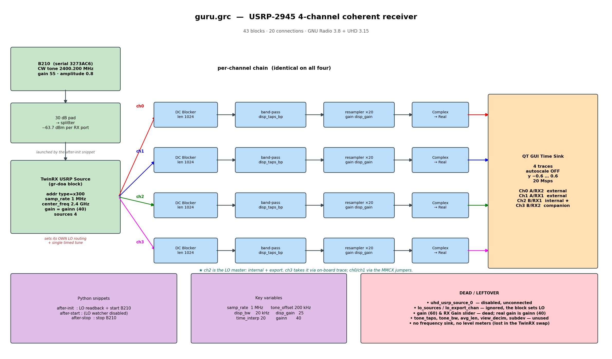

# guru.grc — block diagram

43 blocks, 20 connections. GNU Radio 3.8 + UHD 3.15.

## Signal path

    B210 --(30 dB pad, splitter)--> TwinRX USRP Source --> 4 identical chains --> Time Sink

Each channel:

    DC Blocker (1024) -> band-pass (disp_taps_bp) -> resampler x20 (gain disp_gain) -> Complex to Real

* **DC Blocker** removes the LO self-mixing spike at the tuned centre.
  Measured +58.4 dB -> -34.1 dB.
* **band-pass** keeps 190-210 kHz. `disp_bw = 20e3` is wide on purpose: the
  B210 and X310 are not frequency-locked, so the tone lands ~4 kHz off the
  nominal 200 kHz. Narrower and it rejects the tone and shows pure noise.
* **resampler** interpolates 1 -> 20 Msps so the trace draws smoothly
  (98 samples/cycle instead of 4.9). Its taps also carry the display gain,
  so removing it costs a factor of 500 in amplitude.

No AGC and no phase rotation: every channel is treated identically, so the
scope shows true relative amplitude and true phase.

## Channel routing

The source-to-chain wiring is crossed in the file, but it cancels out — each
USRP channel still lands on its matching sink port:

| USRP | chain | sink port | trace |
|---|---|---|---|
| ch0 | dcblock_0 | 0 | red    — Ch0 RF A/RX2, LO external |
| ch1 | dcblock_2 | 1 | blue   — Ch1 RF A/RX1, LO external |
| ch2 | dcblock_3 | 2 | green  — Ch2 RF B/RX1, LO **internal, exports** |
| ch3 | dcblock_1 | 3 | magenta— Ch3 RF B/RX2, LO companion |

ch2 is the LO master. ch3 takes its LO over an on-board PCB trace;
ch0/ch1 take it through the MMCX jumpers.

## Python snippets

| section | does |
|---|---|
| after-init  | reads the LO routing back from the hardware, then launches the B210 |
| after-start | nothing — the TwinRX block owns tuning, so the LO watcher was removed |
| after-stop  | stops the B210 it started |

## Dead weight still in the file

* `uhd_usrp_source_0` — disabled and unconnected, left from before the TwinRX swap
* `lo_sources`, `lo_export_chan` — **ignored**; the TwinRX block hard-codes its own
  routing, so editing these does nothing
* `gain` (60) and the RX Gain slider — dead; the live control is `gainn` (40)
* `tone_taps`, `tone_bw`, `avg_len`, `view_decim`, `subdev` — unused
* no frequency sink and no level meters — both were lost in the TwinRX swap.
  `guru2/` still has them.
