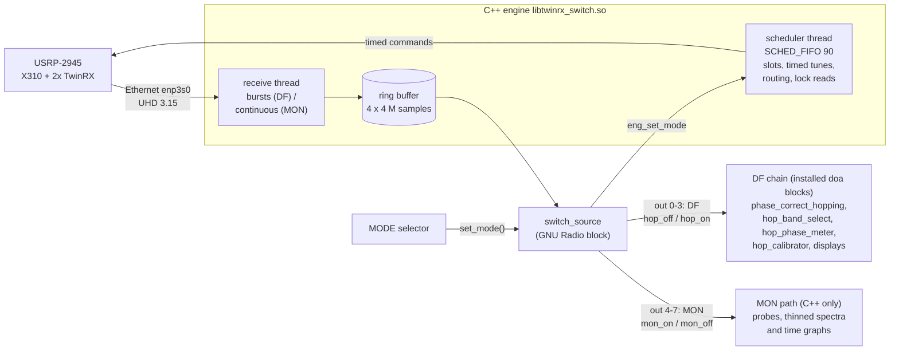

# Engine and custom blocks



## The engine (`oot/engine/twinrx_engine.cpp`)
Built with `cd oot/engine && OUT=libtwinrx_switch.so ./build.sh` against `~/uhd-3.15`. It is a separate library
from the installed DF engine (`libtwinrx_engine.so`), which stays untouched.

### Setup (once)
subdev `A:0 A:1 B:0 B:1`, antennas RX1/RX2/RX1/RX2, DC offset correction on, internal clock, **REF OUT on**
(10 MHz for a lab transmitter's CLKIN), time set at the next PPS, export cleared on all channels, then the start
mode's routing, gains (DF: band gain + per-channel trim; MON: per-channel MON gain), and one untimed tune that pins
the DDC at 0 Hz (checked: `actual_dsp_freq == 0` on every channel, else setup fails).

### Slots
Everything is a **slot** with a start S on the radio clock, in whole samples from the stream start.

**DF slot** (burst):
```
S-0.25 ms  hop_off (guard)       S  gains + ch0 tune       S+0.4/0.8/1.2 ms  ch1..ch3 tune
S+3 ms     second tune pass      S+6.5 ms  lock read (ch2) = burst start (0.25 ms pre-roll)
S+6.75 ms  first dwell sample (hop_on) ... 10,000 samples (5 ms at 2 MS/s) ... next S = dwell end + 0.25 ms
```
7 ms switching + 5 ms dwell = 12 ms per band; 2.4 → 5.2 → 5.8 GHz = 36 ms cycle.

**MON entry slot** (the first MON slot after a switch): same tune timeline with every channel on its own band, then
**one `START_CONTINUOUS`** timed at S + 6.75 ms; lock read of **all four** channels' own synthesisers at S + 6.5 ms.

**MON record** (every 20 ms while MON lasts): no radio command; a lock read 0.5 ms into it (one channel in turn,
ch0→ch3), recorded with its verdict. The GUI's MON sample count comes from the engine (every MON packet counted).

### Switching (only when asked — `eng_set_mode`)
The mode request is taken at the next slot the scheduler plans.

* **DF → MON**: after the last DF dwell's lock read, wait until that dwell has **ended** (+0.2 ms), send the MON
  routing **untimed** (export off, all internal), then the MON entry slot at `S = dwell end + switch_gap (10 ms) + 0.25 ms`.
* **MON → DF**: at the next MON record, `STOP_CONTINUOUS`; wait for the stream's end-of-burst (exact last sample E,
  timeout 0.5 s → timing lost), send the DF routing **untimed** (export off, ch0/ch1 external, ch2 internal,
  ch3 companion, export on ch2), then the DF slot at `S = E + switch_gap + 0.25 ms`. DF restarts its cycle at band 0.

### Verdicts and counters
A slot's verdict (`valid`, `why`): 0 ok · 1 skipped (could not be sent with `min_slack` 3 ms to spare) ·
2 late (batch finished after S) · 3 unlocked · 4 its burst never came. Only valid slots are ever tagged as
dwells. **Timing lost** (no dwell used any more, restart) on: a stream error or overflow, a burst between samples,
never commanded, overlapping, longer or shorter than commanded, no packet for 100 ms, the host ring full, or the
MON stream not stopping. Counters: slots / valid / skipped / late / unlocked, bursts ok / missing,
DF dwell samples + dwells (two independent counters), MON samples, switches / switches not used, last switch
(request time, S, first dwell, verdict, routing time), each channel's last MON lock read.

### C API (ctypes)
| function | |
|---|---|
| `eng_create2(args, fs, nbands, freqs, gains, dwells, trim4, settle, gpre, lock_check, min_slack, start_delay, rt_prio, burst, preroll, has_mon, mon_freq4, mon_gain4, mon_dwell, start_mode, err, errlen)` | set up the radio (DF bands + one MON band) |
| `eng_create(...)` | DF only (as the installed engine) |
| `eng_start(h, hop)` | start; returns the radio time of sample 0 |
| `eng_read(h, c0, c1, c2, c3, max_n, wait_ms)` | copy samples out of the ring |
| `eng_slots(h, from_id, out, max_rows)` | slot rows: id, S, freq, next, valid, why, mode, band, pre, tuned |
| `eng_set_mode(h, 0/1)` | request DF / MON (a repeat of the same request is ignored) |
| `eng_mode_info(h, o[16])` | want, mode, switches, bad, last request, last S, last first dwell, verdict, switched to, MON samples, DF samples, routing ms, 4 × MON lock |
| `eng_set_switch_gap(h, s)` | gap before a mode switch (default 10 ms) |
| `eng_stats`, `eng_burst_info`, `eng_lost_reason`, `eng_stop`, `eng_destroy` | as in the DF engine |

Set `TWINRX_ENGINE_TIMING=<file>` to write a per-slot timing record at stop (where the scheduler's time went).

## Custom GNU Radio blocks

### `switch_source` — TwinRX DF/MON Radio-Clock Source (this repo, `switch_source.py`, `grc/switch_source.block.yml`)
Not installed: `run_hop.sh --switch` runs it from this folder; `grcc` needs `GRC_BLOCKS_PATH=$GRC_BLOCKS_PATH:$PWD/grc`.

| parameter | default | |
|---|---|---|
| samp_rate | 2e6 | per channel (200 MHz / an integer) |
| bands (num_bands, freq_i, gain_i, dwell_i) | 2.4/5.2/5.8 GHz, 46/60/69 dB, 5 ms | DF bands |
| settle, guard_pre | 7 ms, 0.25 ms | switching time per DF slot, part of it before S |
| gain_trim | (0, −13.3, 1.5, −1.7) | per-channel DF gain trim |
| lock_check, min_slack, preroll | 6.5 ms, 3 ms, 0.25 ms | lock read time, send margin, burst pre-roll |
| rt_priority | 90 | SCHED_FIFO for the engine threads (needs an rtprio limit) |
| mon_freqs, mon_gains | (900e6, 2.4e9, 5.2e9, 5.8e9), (60, 46, 60, 69) | MON band and gain of ch0..ch3 |
| mon_dwell | 20 ms | MON record length (lock read period) |
| start_mode | `mode` (the MODE selector) | 'df' / 'mon'; **callback `set_mode`** — changing it switches |
| switch_gap | 10 ms | |
| tx_control, park_freq | 127.0.0.1:5123, LAB TONE | lab transmitter only (callback `set_park_freq`) |

Outputs 0–3 (**DF**): exactly as `twinrx_radio_source`: `rx_time` at sample 0, `hop_off` at S − guard
(value: the band, or −1 = no band, used for the start of a MON period), `hop_cycle` at every switch into band 0,
`hop_on` at the first sample of a verified dwell. Zeros outside DF.
Outputs 4–7 (**MON**): `mon_on` at the start of every verified MON record, `mon_bad` (value: why) for one that
was not, `mon_off` right after the last MON sample. Zeros outside MON.
End marks are placed at the exact end of the old mode's last dwell (not after the switch gap).

Methods: `set_mode(m)`, `get_mode_info()`, `get_schedule_stats()`, `get_burst_info()`, `get_band_lock_stats()`
(MON under key −1.0), `get_current()`, `is_timing_lost()`, `stream_is_alive()`, `set_park_freq(f)`.

### DF blocks (installed `doa` package, unchanged — same as guru_DF_v1, sources in `oot/`)
* **phase_correct_hopping** — rotates channel c by its band's calibrated offset, switched on the hop tags,
  sample-exact (the offset is a property of the band: using the 2.4 GHz table at 5.8 GHz is 29–127° wrong).
* **hop_band_select** — passes only the dwell samples of one band (for the plots and spectrum).
* **hop_phase_meter** — per dwell window of one band: tone ≥ 20 dB over the in-band median on every channel,
  then chN − ch0 phase (circular mean over the last N windows); NaN / "NO TONE" when not measured; records the
  window length, the tone frequency and the tone cycles counted in the window.
* **hop_calibrator** — CALIBRATE: re-measures the table on the live chain (see THEORY §7).
* **hop_dc_remove** — each dwell's mean removed (only for tones near 0 Hz; not used at 200 kHz).
* **twinrx_radio_source** — the DF-only source (guru_burst); `switch_source` replaces it here.

### MON path (in `guru_switch.grc`, stock C++ blocks only)
per channel: `stream_to_vector(4096) → keep_one_in_n(10) → vector_to_stream` → spectrum + time graph (whole blocks
of real samples, one in 10); `stream_to_vector(8192) → keep_one_in_n(25) → probe_signal_vc` → the status line
(strongest line of the newest 8192 samples, level over the noise median, ADC peak; a block that overlaps a switch —
zeros — is not read). A Python meter on all 4 MON streams made the flowgraph fall behind at once (TIMING LOST);
that is why the MON path has no Python.
